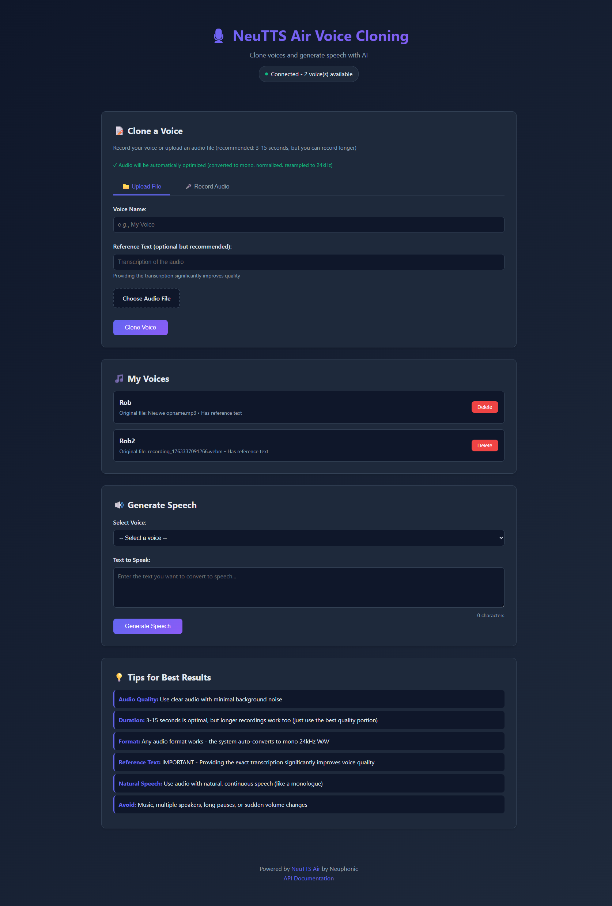

# NeuTTS Air Voice Cloning API - Docker Container

A Dockerized REST API with web UI for voice cloning and text-to-speech using [NeuTTS Air](https://github.com/neuphonic/neutts-air) by Neuphonic.



## Features

- **Web UI** for easy voice cloning and speech generation
- Clone voices from audio samples
- Generate text-to-speech with cloned voices
- RESTful API interface
- Persistent voice profiles
- CPU and GPU support

## Quick Start

### 1. Setup

Clone this repository and create environment file:

```bash
cp .env.example .env
```

Edit `.env` if needed (default uses CPU):

```
BACKBONE_DEVICE=cpu
CODEC_DEVICE=cpu
```

For GPU support, change to `cuda`:

```
BACKBONE_DEVICE=cuda
CODEC_DEVICE=cuda
```

### 2. Build and Run

```bash
docker-compose up -d --build
```

The service will be available at `http://localhost:8080`

### 3. Access the Web UI

Open your browser and navigate to:

```
http://localhost:8080
```

You'll see a web interface where you can:

- Upload audio files to clone voices
- View all your cloned voices
- Generate speech from text using any cloned voice
- Play and download generated audio

### 4. Check Status

```bash
curl http://localhost:8000/health
```

## Using the Web UI

The web interface provides an intuitive way to use the voice cloning service:

1. **Clone a Voice:**

   - Click "Choose Audio File" and select a 3-15 second audio sample
   - Enter a name for your voice (e.g., "My Voice")
   - Optionally provide a transcription of the audio
   - Click "Clone Voice" and wait for processing

2. **View Cloned Voices:**

   - All cloned voices appear in the "My Voices" section
   - You can delete voices you no longer need

3. **Generate Speech:**
   - Select a voice from the dropdown
   - Type or paste the text you want to convert to speech
   - Click "Generate Speech"
   - Play the audio in the browser or download it

## API Usage

You can also interact with the service programmatically via the REST API:

### Clone a Voice

Upload an audio file to clone a voice:

```bash
curl -X POST http://localhost:8080/voices/clone \
  -F "file=@/path/to/your/voice.wav" \
  -F "voice_name=my_voice" \
  -F "reference_text=Optional transcription of the audio"
```

**Best practices for reference audio:**

- Duration: 3-15 seconds
- Format: WAV (mono, 16-44 kHz)
- Quality: Clear speech, minimal background noise
- Content: Natural continuous speech

**Response:**

```json
{
  "status": "success",
  "message": "Voice 'my_voice' cloned successfully",
  "voice_id": "uuid-here",
  "voice_name": "my_voice"
}
```

### Generate Speech

Convert text to speech using a cloned voice:

```bash
curl -X POST http://localhost:8080/tts/generate \
  -F "text=Hello, this is my cloned voice speaking!" \
  -F "voice_name=my_voice" \
  -F "output_filename=output.wav" \
  --output generated_speech.wav
```

**Response:** WAV audio file (24kHz)

### List All Voices

```bash
curl http://localhost:8080/voices
```

**Response:**

```json
{
  "voices": [
    {
      "name": "my_voice",
      "id": "uuid-here",
      "original_file": "voice.wav",
      "has_reference_text": true
    }
  ]
}
```

### Delete a Voice

```bash
curl -X DELETE http://localhost:8080/voices/my_voice
```

## Python Example

```python
import requests

# Clone a voice
with open("my_voice.wav", "rb") as f:
    response = requests.post(
        "http://localhost:8080/voices/clone",
        files={"file": f},
        data={
            "voice_name": "john",
            "reference_text": "This is my voice sample"
        }
    )
print(response.json())

# Generate speech
response = requests.post(
    "http://localhost:8080/tts/generate",
    data={
        "text": "Hello, this is a test of voice cloning!",
        "voice_name": "john"
    }
)

# Save the generated audio
with open("output.wav", "wb") as f:
    f.write(response.content)
```

## JavaScript/TypeScript Example

```javascript
// Clone a voice
const formData = new FormData();
formData.append("file", audioFile); // File object from input
formData.append("voice_name", "sarah");
formData.append("reference_text", "Optional transcription");

const cloneResponse = await fetch("http://localhost:8080/voices/clone", {
  method: "POST",
  body: formData,
});
const cloneResult = await cloneResponse.json();

// Generate speech
const ttsData = new FormData();
ttsData.append("text", "This is my cloned voice!");
ttsData.append("voice_name", "sarah");

const ttsResponse = await fetch("http://localhost:8080/tts/generate", {
  method: "POST",
  body: ttsData,
});
const audioBlob = await ttsResponse.blob();

// Play or download the audio
const audioUrl = URL.createObjectURL(audioBlob);
const audio = new Audio(audioUrl);
audio.play();
```

## Additional Resources

Once the container is running:

- **Web UI:** `http://localhost:8080`
- **Swagger API Docs:** `http://localhost:8080/docs`
- **ReDoc API Docs:** `http://localhost:8080/redoc`

## Directory Structure

```
.
├── Dockerfile              # Container definition
├── docker-compose.yml      # Docker Compose configuration
├── api_server.py          # FastAPI application
├── .env.example           # Environment variables template
├── README.md              # This file
├── test_api.py            # Python test script
├── static/                # Web UI files
│   ├── index.html         # Main web interface
│   ├── style.css          # Styling
│   └── app.js             # Frontend JavaScript
├── voices/                # Persisted voice profiles (created on first run)
│   ├── profiles.json      # Voice metadata
│   └── *.wav              # Reference audio files
└── outputs/               # Generated audio files (created on first run)
```

## GPU Support

To use NVIDIA GPU:

1. Install [NVIDIA Container Toolkit](https://docs.nvidia.com/datacenter/cloud-native/container-toolkit/install-guide.html)

2. Update `.env`:

```
BACKBONE_DEVICE=cuda
CODEC_DEVICE=cuda
```

3. Uncomment the GPU section in `docker-compose.yml`:

```yaml
deploy:
  resources:
    reservations:
      devices:
        - driver: nvidia
          count: 1
          capabilities: [gpu]
```

4. Rebuild and run:

```bash
docker-compose up -d --build
```

## Troubleshooting

### Container won't start

```bash
docker-compose logs -f
```

### Check API health

```bash
curl http://localhost:8080/health
```

### Reset everything

```bash
docker-compose down
rm -rf voices/* outputs/*
docker-compose up -d --build
```

### Out of memory errors

- Reduce concurrent requests
- Switch to CPU mode if using GPU
- Allocate more Docker memory

## Performance Tips

1. **Pre-encode voices:** Clone all voices before heavy usage
2. **GPU acceleration:** Significantly faster with CUDA support
3. **Optimal audio:** 3-15 second mono WAV files at 24kHz
4. **Reference text:** Provide transcriptions for better quality

## Limitations

- CPU mode is slower but works everywhere
- GPU requires NVIDIA GPU + drivers
- First inference is slower (model loading)
- Audio quality depends on reference sample quality

## Credits

This container wraps [NeuTTS Air](https://github.com/neuphonic/neutts-air) by Neuphonic.

## License

This wrapper is provided as-is. Refer to the [NeuTTS Air repository](https://github.com/neuphonic/neutts-air) for the model's license.
